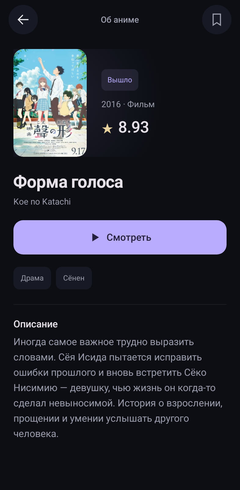

# ShikiMove

Неофициальный Android-клиент Shikimori с каталогом, личным списком и нативным плеером. Android 8.0 и новее.

## Версия 0.2.1

- В карточке аниме одна кнопка **Смотреть**. Озвучка, серии и качество выбираются в плеере; сохранённая позиция подхватывается автоматически.
- Три раздела: каталог, мой список, профиль. Тёмный интерфейс без лишних блоков.
- Нативный Media3 ExoPlayer вместо iframe: качество, скорость, перемотка на 10 секунд, озвучки, сезоны, серии, автопереход и поворот экрана.
- Сохранение позиции внутри серии на устройстве.
- Вход через официальную страницу Shikimori в WebView; пароль приложение не перехватывает и не сохраняет отдельно.
- Синхронизация списков, статусов, оценок и количества просмотренных серий. Неотправленные изменения сохраняются и повторяются при открытом приложении и следующем запуске.
- Гостевой список и данные каждого аккаунта разделены. Гостевой список автоматически в аккаунт не переносится.



[Скачать APK из последнего релиза](https://github.com/L33kr/Play/releases/tag/v0.2.1)

## Как пользоваться

1. Установить APK. В профиле нажать **Войти в Shikimori**, войти логином и паролем на официальной странице, нажать **Готово**.
2. Открыть аниме из каталога или своего списка и нажать **Смотреть**. Для статуса и оценки нажать значок закладки вверху карточки.
3. В плеере: двойное нажатие по левой/правой части — −10/+10 секунд; кнопка настроек — озвучка, заполнение экрана, автопереход и отметка просмотра.
4. По окончании просмотра основной серии её номер отправляется в Shikimori. Спецвыпуски не меняют счётчик основного сезона. Точная позиция в секундах остаётся на устройстве: API Shikimori её не хранит.

Сторонний вход через Google/VK в этой версии не переносит сессию из внешнего браузера: используйте логин и пароль Shikimori. При истечении сессии приложение предложит войти снова.

## Просмотр

Поиск выполняется через `https://api.andb.workers.dev/search` с `shikimori_id` и `with_episodes_data=true`. Если соответствия по ID нет, допускается точное совпадение названия без конфликтующего ID.

Для выбранной серии приложение читает параметры публичного Kodik-плеера, получает HLS-ссылки и передаёт поток ExoPlayer. Качества берутся из ответа сервиса; ссылки для других качеств не подставляются вручную. Сервис может менять протокол и ограничивать доступ по сети или региону. При ошибке доступен повтор, выбор другой озвучки и переход на amove.

Алгоритм получения потока адаптирован по [pewaru-333/ShikiApp](https://github.com/pewaru-333/ShikiApp), файл `KodikParser.kt`. Токены чужих приложений не используются. См. [THIRD_PARTY.md](THIRD_PARTY.md).

## Аккаунт

Используется сессия официального сайта `https://shikimori.io`, которую поддерживают текущие серверные контроллеры API. Это не OAuth-приложение; регистрация client ID/secret не требуется. Cookie передаются только на этот фиксированный адрес, переходы API на другие домены запрещены. Плеер использует отдельный HTTP-клиент без cookie Shikimori. Резервное копирование приватных данных Android отключено.

В профиле можно вручную повторить синхронизацию. Изменения статуса и оценки применяются только к соответствующим полям, автоматический счётчик серий не уменьшается относительно сервера. Выход сохраняет очередь под ID прежнего аккаунта и не отправляет её от имени другого.

## Сборка

JDK 17, Android SDK 35, Build Tools 35.0.0. В Android Studio открыть корень проекта и дождаться синхронизации Gradle. Для командной строки указать SDK в `local.properties`:

```properties
sdk.dir=/path/to/android-sdk
```

```bash
./gradlew :app:testDebugUnitTest :app:lintDebug :app:assembleDebug
```

APK: `app/build/outputs/apk/debug/app-debug.apk`. В GitHub Actions APK доступен как артефакт сборки; после успешной проверки `main` workflow один раз публикует тестовый релиз `v0.2.1` и сохраняет уже опубликованные файлы без изменений.

Debug-сборки подписываются ключом окружения сборки. Сборки из разных окружений могут требовать удаления прежней версии; для постоянных обновлений настройте собственный release-ключ через GitHub Secrets, не добавляя его в исходники.

## Проверки

Для отдельной проверки живого видеосервиса: `SHIKIMOVE_LIVE_VIDEO=1 ./gradlew :app:testDebugUnitTest --tests io.shikimove.app.LiveVideoTest`. Обычные тесты не зависят от доступности стороннего источника.

См. [VALIDATION.md](VALIDATION.md) — выполненные проверки и ограничения. Доступность видео и входа на конкретном телефоне зависит также от сети, WebView и состояния внешних сервисов.

## Лицензия

GPL-3.0; полный текст в [LICENSE](LICENSE). ShikiMove не является официальным приложением Shikimori, amove или Kodik.
